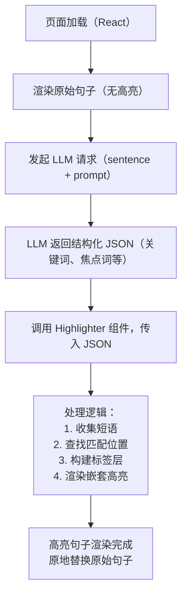

# The Description of the Project

## Key Ideas

Thanks — from your previous messages, it seems you’re building a reading tool like an IDE, which does the following:

* Breaks down text into paragraphs, sentences, and tokens, each as semantic objects
* Allows for hovering over sentences or tokens to reveal semantic metadata (e.g., function, purpose, mood)
* Highlights semantic elements like subject-verb-object, conjunctions, and narrative relationships
* Integrates with a React frontend, possibly with back-end analysis by an LLM
* Is aimed at deep reading, comprehension, or analysis, not just casual reading

⸻

### Problem It Solves

📌 Problem:

Most digital reading tools (e.g., Kindle, PDF viewers, browser readers) are passive and linear. They don’t support:

* Actively engaging with sentence structure or purpose
* Visualizing semantic roles or relationships between parts of a text
* Understanding how parts of a narrative explain, rebut, contrast, or support each other
* Training analytical reading skills needed in academic, legal, philosophical, or persuasive texts

💡 Solution Your App Offers:

A semantic reading environment that:

* Acts like a semantic debugger for reading
* Makes invisible structures visible (functions, logic, emphasis, hierarchy)
* Helps readers parse complex arguments, spot manipulative rhetoric, or improve writing skills
* Can be used in education, research, or critical reading training

## Layers of A Sentence

* Words
* Punctuations
* Semantic roles
* Grammatical Structure
  * SVO
  * Attributes
  * Connection words

The LLM need to highlight the parts(Semantic roles and grammatical structure) that are important to a sentence. Extraction of words can be handled by hard coding. Probably in the early stage, we should focus more on semantic role. In the early development, the code logic should allow any block of text to be highlighted. We will be working on the rule of highlighting. 

## Layers of A Paragraph

* Sentence
* Role of each sentence

## Example of Functionality

### Example 1

"This is a test **sentence** *which* [would shows how things work]."

When hovering above the word *which*, the corresponding subclause should be highlighted and the word (**sentence** in this case) it refers to.

### Example 2

"Because of the disaster, the town lost 100 million dollars overnight."

The comma belongs to the set of tokens, but should not response to mouse hovering for the sake of convenience of sentence rerendering and clarification. But the period should be ignored when parsing the sentence into a token array. It also should highlight the conjunction word here (**Because** in this case)

### Example 3

“Wendy had just read Fifty Shades of Grey, the first book in the trilogy of erotica that was approaching, in America, twenty million copies sold, that was breaking records for weekly sales rates, that Wendy and so many others labeled and laughed about as “mommy porn.”

This is a long sentence.

# Process graph

